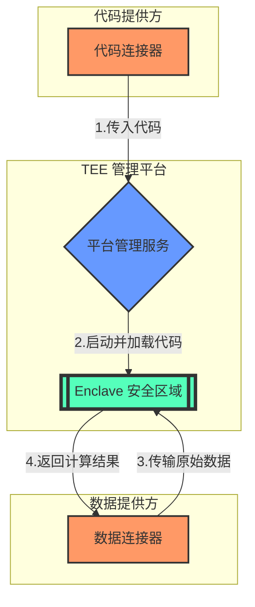

# TEE 管理平台工作流程


## 流程说明

1. **代码上传**：代码连接器将代码传入 TEE 管理平台
2. **启动执行**：TEE 管理平台启动 Enclave 执行代码
3. **数据传输**：数据连接器将数据传输给 Enclave 内正在运行的代码
4. **结果返回**：将数据处理结果返回给数据连接器

## 流程图



## 部署

```bash
# 1. 编译代码连接器
cd code-connector
go build -o code-connector main.go

# 2. 编译数据连接器
cd ../data-connector
go build -o data-connector main.go

# 3. 启动 TEE 管理平台
cd ../enclave-manager
go run main.go

# 4. 启动代码连接器（传入处理代码）
./code-connector /path/to/your/code

# 5. 启动数据连接器（传入数据文件）
./data-connector /path/to/your/data.txt
```

